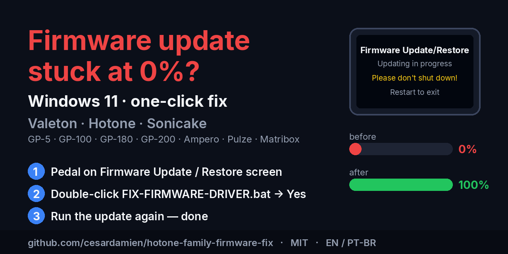

# Pedal stuck on "Firmware Update / Restore" and the PC sits at 0%?

[🇧🇷 Português](README.pt-BR.md) · **Valeton · Hotone · Sonicake · Windows 11**

<b>Download one file. Double-click it. Click "Yes". Run the update again.</b>

If your pedal's screen says **"Firmware Update / Restore — Please don't shut down"** while the updater on your computer sits at **0 %** and then closes, you have hit a **Windows 11** problem, not a pedal problem. The pedal is not broken. Nothing is lost. It takes two minutes to fix, with no driver downloads, no Windows update rollback and no second computer.

This applies to **every** pedal from Valeton (GP-5, GP-50, GP-100, GP-150, GP-180, GP-200, GP-200JR, GP-200LT, GP-300), Hotone (Ampero, Ampero One, Ampero Mini, Ampero II, II Stomp, II Stage, II XL, Pulze, Pulze Mini, Jogg, UA-12) and Sonicake (Matribox, Matribox II and II Pro, Pocket Master, Smart Box, Sonic Cube, AMPCUBE). Three brands, one factory, the same USB electronics — and they all break the same way.

---

## Fix it now

**1.** Download **[`FIX-FIRMWARE-DRIVER.bat`](https://github.com/cesardamien/hotone-family-firmware-fix/releases/latest/download/FIX-FIRMWARE-DRIVER.bat)**. Put it in any folder — Downloads is fine.

**2.** Keep the pedal **powered on, connected by USB and on the "Firmware Update / Restore" screen**. If it is already there, leave it alone. If it is not, open Valeton Suite (or the Hotone updater), click *Firmware Update* and let it fail — the pedal will land on the right screen.

**3.** **Double-click** `FIX-FIRMWARE-DRIVER.bat`. Windows asks *"Do you want to allow this app to make changes to your device?"* — click **Yes**. If a blue SmartScreen page appears first saying Windows protected your PC, click *More info* → *Run anyway* (that page shows for any internet download without a paid code-signing certificate).

**4.** A few seconds later a Notepad window opens with the result. Look for the word **SUCCESS** at the end. If it is there, open Valeton Suite, click *Firmware Update*, pick the firmware `.bin` and watch the bar go to 100 %.

If Windows asks to restart, choose *Restart later* and run the update first. It usually works right away.

That is all. The rest of this page is for people who want to know what happened or have a question.

---

## What was wrong (no jargon)

When the pedal enters update mode it *becomes a different device* as far as Windows is concerned — as if you had unplugged the pedal and plugged in something nobody had ever seen. Windows then picks a driver for this new device on its own.

Until early 2026 Windows picked the driver the Valeton/Hotone updater expects (the generic *USB audio* driver). In February 2026 Microsoft shipped a new MIDI system for Windows 11, and from then on Windows prefers a new *MIDI* driver for any device of this kind. The updater cannot talk through that new driver: it sends the first firmware packet, gets no answer, and gives up. That is the 0 % that closes.

Valeton and Hotone know about it and published a notice telling you to swap the driver by hand in Device Manager. The notice is correct, but it leaves two gaps that make a lot of people give up:

First, it does not say the swap must be done **while the pedal is on the update screen**. If you swap the driver with the pedal in normal mode — which is what most people do, because that is when it shows up under a familiar name — you are fixing the wrong device, and afterwards you are sure you "already did the fix and it didn't work".

Second, once you do open Device Manager with the pedal in the right mode, the *"USB Audio Device"* option often **is not in the list at all**, because Windows hides anything it ranks below the new driver. The official tip to keep *"Show compatible hardware"* ticked is exactly what hides it.

`FIX-FIRMWARE-DRIVER.bat` performs the right swap, on the right device, by a route that does not depend on that list: it finds any connected Valeton/Hotone/Sonicake device and applies the USB audio driver that already ships inside Windows, using the same Windows function Device Manager uses under the hood. It downloads nothing, installs nothing from outside, and touches no other device on your computer.

---

## Questions people always ask

**Is this safe? It is a .bat from the internet asking for administrator rights.**
Fair question. Open the file in Notepad: everything it does is written there in readable PowerShell, nothing packed or hidden. It needs administrator rights because Windows requires them for any driver change — the same prompt would appear if you did the swap by hand. It only looks at devices with vendor code `84EF` (Valeton/Hotone/Sonicake); the rest of your computer is not even listed. If you would rather look before touching anything, `DIAGNOSE-ONLY.bat` shows what is connected and which driver it uses, changes nothing, and asks for no administrator rights.

**Will I have to do this every time I update firmware?**
Probably. Windows reinstalls the driver for the "update-mode device" every time, and every Microsoft update pushes it back to the MIDI driver. Keep the file. The ritual is always the same: pedal on the update screen → double-click → update.

**Does it change anything for normal use? Playing, recording, the editor?**
No. After the update the pedal reboots and becomes the "normal device" again with its usual driver (the vendor ASIO driver or Windows' own). The USB audio driver stays on the "update-mode device", which nothing uses outside of firmware updates.

**Notepad says "No VID_84EF device is connected right now".**
The pedal is not in update mode, or the cable is charge-only. Use the cable from the box, plug straight into the PC (no hub), get the pedal to the *Firmware Update / Restore* screen and run it again.

**It said SUCCESS but the update still stops at 0 %.**
Restart Windows, leave the pedal on the update screen, run the update again. If it still fails, switch to a USB-A port wired directly to the motherboard (back of a desktop, side of a laptop; avoid USB-C). If it persists, open an issue here with the `firmware-fix-log.txt` that sits next to the `.bat` — we will work it out together.

**The update passed 100 % and a second bar started, "BT And PD Updating".**
Normal. Some firmware packages update two chips: the main one and the Bluetooth/power one. Let it finish; the pedal reboots itself at the end.

**I am on a Mac / Linux / Windows 10.**
Then this is not your problem. The new MIDI driver exists only on Windows 11 updated from February 2026 onwards.

---

## Confirmed where, expected where

This project was born from a **Valeton GP-180** (V1.0.0 → V1.1.1) on a fully updated Windows 11 25H2, after several days stuck. On that pedal it is confirmed and documented, log included ([docs/EXAMPLE-LOG.md](docs/EXAMPLE-LOG.md)).

On the other models the fix is the same by construction: same USB vendor code, same MIDI-based update mode, same official notice from both brands. But I do **not yet have a log from each one**. If it worked on yours — or did not — open an issue with the model and the log; it takes a minute and it is what turns "expected" into "confirmed" in the [device table](docs/SUPPORTED-DEVICES.md) for the next person.

---

## Symptoms people search for

If any of these describe you, you are in the right place: *Valeton firmware update stuck at 0%* · *Valeton Suite firmware update not working Windows 11* · *GP-200 / GP-180 / GP-100 stuck on Firmware Update Restore screen* · *Valeton pedal "please don't shut down" frozen* · *Hotone Ampero firmware update fails Windows 11* · *Ampero II Stomp / Stage update stuck* · *Sonicake Matribox firmware update 0%* · *USB Audio Device not in driver list* · *Valeton driver MIDI instead of USB audio* · *Windows 11 usbmidi2 firmware update bootloader* · *Valeton GP-180 bricked after update* (it is not bricked — run the fix and update again).

Português: *atualização de firmware Valeton travada em 0%* · *pedaleira Valeton presa na tela Firmware Update Restore* · *Valeton Suite não atualiza firmware Windows 11* · *Dispositivo de Áudio USB não aparece na lista* · *Hotone Ampero atualização de firmware não funciona*.

Español: *Valeton actualización de firmware se queda en 0%* · *Hotone Ampero actualización firmware Windows 11 no funciona* · *pedalera bloqueada en Firmware Update Restore*.

---

## Files in this repository

`FIX-FIRMWARE-DRIVER.bat` is the only file you need: the whole script lives inside it. `DIAGNOSE-ONLY.bat` is optional, looks and changes nothing (must sit in the same folder as the first). `source/Fix-FirmwareDriver.ps1` is the same script as a standalone PowerShell file, for reading or running directly. `docs/` has the device list and the real example log.

Made by Cesar Damien, with the analysis and code developed together with Claude (Anthropic), after a brand-new GP-180 spent days on the update screen. Not affiliated with Valeton, Hotone, Sonicake or Microsoft. References: [Valeton notice](https://www.valeton.net/win11-technical-notice/), [Hotone notice](https://www.hotone.cl/actualizacion-de-firmware-en-windows-11/), [Sweetwater article](https://www.sweetwater.com/sweetcare/articles/valeton-gp-series-firmware-update-fix-on-windows-11/), [Windows MIDI Services announcement](https://blogs.windows.com/windowsexperience/2026/02/17/making-music-with-midi-just-got-a-real-boost-in-windows-11/), [the same problem reported to Microsoft](https://github.com/microsoft/MIDI/issues/944). MIT License — use it, copy it, improve it.
